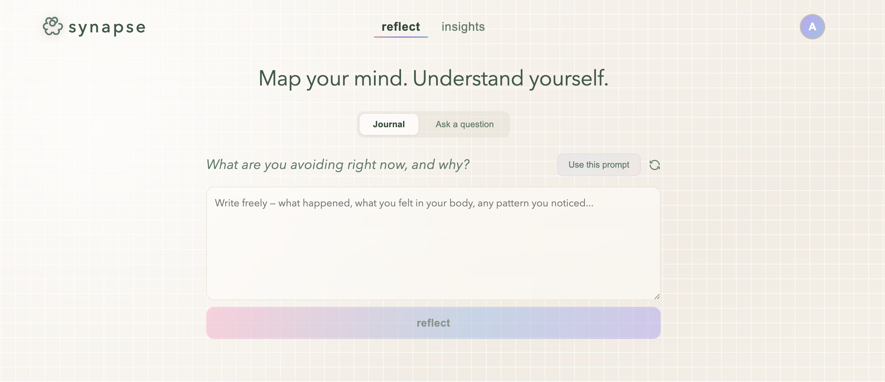
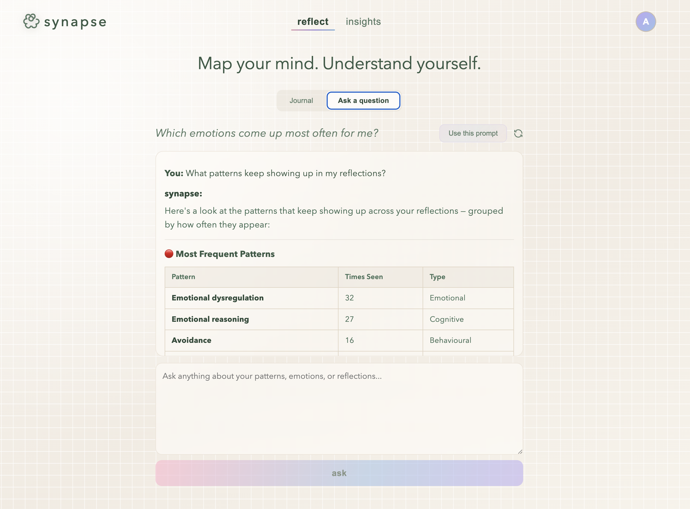
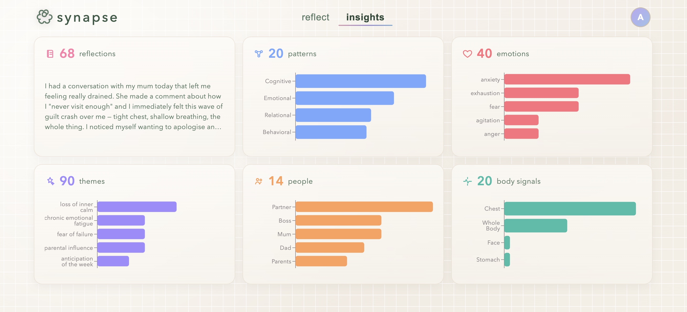
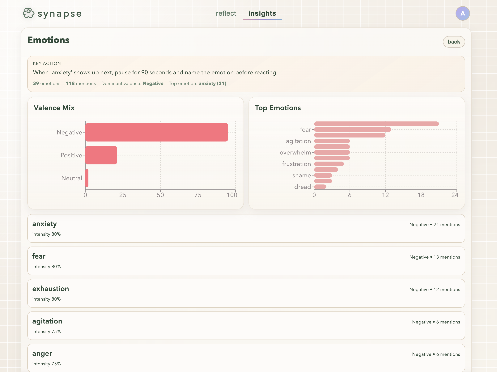
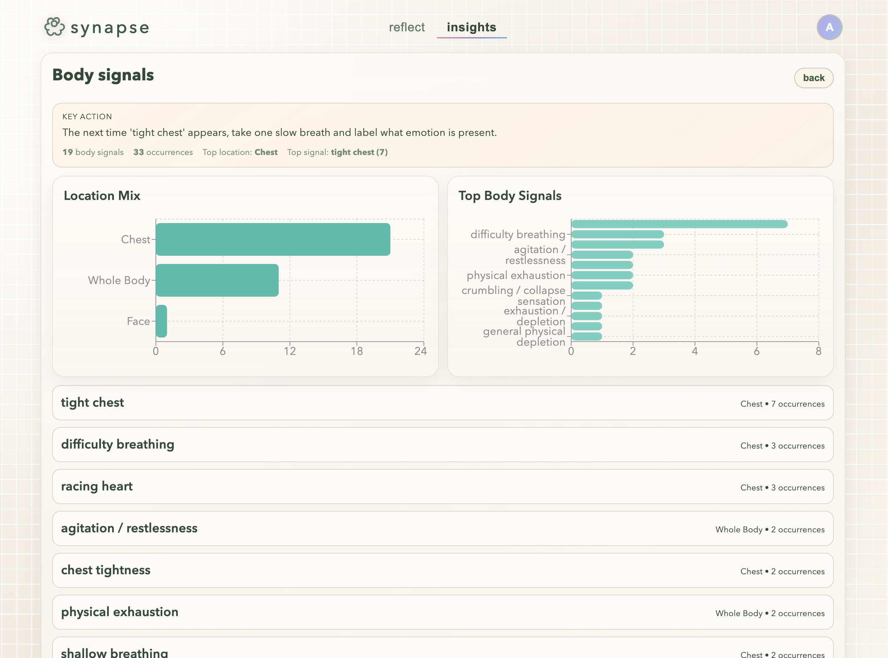
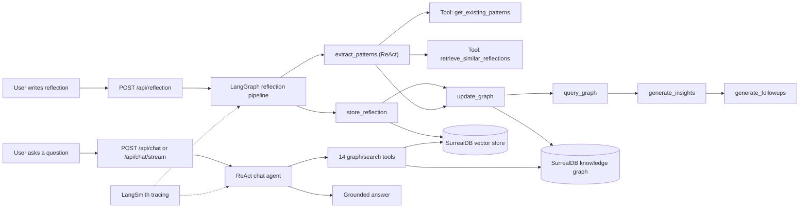

# synapse

**Journaling that remembers and reasons in context.**

Synapse is a memory-first reflection agent built for the London LangChain x SurrealDB Hackathon.
It turns unstructured reflections into a persistent knowledge graph, then answers questions from that evolving graph context.

<p align="center">
  
  
</p>
<p align="center">
  
  
  
</p>

Public demo: [synapse-frontend-vdmo.onrender.com](https://synapse-frontend-vdmo.onrender.com/)

---

## User quickstart (2 minutes)

### Web app

1. Open the public demo: [synapse-frontend-vdmo.onrender.com](https://synapse-frontend-vdmo.onrender.com/)
2. Create an account (or log in).
3. Go to `reflect`, write a short reflection, and press `reflect`.
4. Review extracted patterns, emotions, themes, and follow-up questions.
5. Switch to `talk` and ask a question like: `What pattern shows up most when I mention work feedback?`

### Telegram (text + voice notes)

Start chat: [@synapse_helper_bot](https://t.me/synapse_helper_bot)

1. Message the Synapse Telegram bot: [@synapse_helper_bot](https://t.me/synapse_helper_bot) (for deployments where the bot is enabled).
2. First-time setup is inline: share email + password when prompted.
3. Send a text reflection and get analysis back in chat.
4. Or send a voice note; Synapse transcribes it and runs the same reflection pipeline.
5. If you already have a web account, use `/link` to connect Telegram to that account.

## Why this project exists

Most AI journaling tools are stateless or shallowly stateful. They can sound empathetic, but they forget pattern history and repeat generic advice.

Synapse is built to solve that:

- persistent, structured memory in SurrealDB
- agent orchestration with LangGraph + LangChain tools
- grounded responses based on stored user context, not only the latest prompt

---

## Psychotherapy methodologies behind Synapse

Synapse is grounded in established reflection methodologies, not generic motivational output:

- **CBT (Cognitive Behavioral Therapy):**
  - Looks for thought patterns such as catastrophizing, all-or-nothing thinking, and mind-reading.
  - Stores these as recurring `pattern` nodes and links them to themes/people that co-occur.
  - Helps users spot repeat loops and test alternative interpretations.
- **DBT (Dialectical Behavior Therapy):**
  - Captures emotional valence/intensity plus trigger context and body-state cues.
  - Stores emotional patterns in `emotion` + `triggered_by`/`expresses` relationships.
  - Helps users identify when dysregulation starts and what tends to escalate or reduce it.
- **IFS (Internal Family Systems):**
  - Detects internal parts and role dynamics (`manager`, `firefighter`, `exile`).
  - Persists these in `ifs_part` nodes and activation links from reflections.
  - Helps users separate protective strategies from underlying vulnerable states.
- **Schema Therapy:**
  - Tracks deeper enduring schemas (for example abandonment, self-sacrifice, unrelenting standards).
  - Stores schema domain and coping style (`surrender`, `avoidance`, `overcompensation`) in `schema_pattern` nodes.
  - Helps users connect present reactions to long-running life patterns.

How this links to the system end-to-end:

1. The extraction agent applies these lenses to each reflection and outputs structured JSON.
2. SurrealDB stores each lens as durable graph entities and relationships.
3. LangGraph queries historical graph context before synthesis, so insights reflect trajectory over time.
4. The chat agent uses graph tools to answer from concrete history: patterns, people, triggers, body signals, and schema/IFS context.

This is the core product value: clinically informed reflection frameworks translated into persistent machine-readable memory, then used by agents to deliver clearer, more consistent, and more context-aware guidance over time.

Important boundary: Synapse is a reflection tool and pattern coach, not a replacement for therapy or medical care.

---

## Safeguards implemented

Synapse includes explicit safety and reliability guardrails across prompts and runtime behavior:

- **Safety guardrails on every prompt:** crisis-response instructions, non-diagnostic constraints, and non-pathologizing language are prepended across extraction, chat, insight, and follow-up prompts.
- **Crisis-oriented instruction set:** prompts include explicit crisis resource routing (UK/US/international) and direct the model to prioritize immediate support language.
- **Data sensitivity rule:** prompts instruct the system to summarize patterns from history rather than unexpectedly quoting sensitive past reflection text.
- **Strict structured-output contracts:** extraction is instructed to return JSON-only; follow-up generation is instructed to return exactly 3 questions in JSON array format.
- **Fail-safe parsing behavior:** if extraction or follow-up parsing fails, the pipeline degrades gracefully to safe fallback outputs instead of crashing request flow.
- **Input normalization and tenancy boundaries:** reflection source values are normalized to known enums, and core graph/data queries are user-scoped by `user_id`.
- **Protected API surface:** reflection/chat/dashboard endpoints require JWT auth.

---

## Data security and access controls

User data is stored and accessed with layered controls in the current implementation:

- **Password security:** user passwords are hashed with `bcrypt` (never stored in plaintext).
- **Token-based access:** protected endpoints require signed JWT bearer tokens.
- **User-scoped data access:** reflection and graph queries are filtered by `user_id` to isolate each account's data.
- **Account integrity controls:** user email has a unique index, and password reset tokens are unique with 1-hour expiry.
- **Telegram linking control:** Telegram accounts are linked through explicit credential verification (`/link`) or in-bot account creation.
- **Secrets-based configuration:** database/API credentials are loaded from environment variables rather than hardcoded.

For production deployments, set a strong `JWT_SECRET`, enforce secure environment management, and apply your platform/network security policies.

---

## What Synapse does today

- Ingests reflections through a 6-node LangGraph pipeline
- Extracts patterns/emotions/themes/IFS parts/schemas/people/body signals using CBT/DBT/IFS/Schema Therapy lenses
- Persists graph entities + typed relations + vector embeddings in SurrealDB
- Generates personalized insights and follow-up questions
- Supports conversational "ask your graph" analysis with a ReAct tool-calling agent
- Ships as a full app surface:
  - React web app (`reflect` + `talk`)
  - FastAPI backend
  - Telegram bot where users can reflect by text or voice note

---

## Telegram integration (write or speak your reflections)

Synapse is intentionally multichannel. Reflection capture is not limited to the web UI.

Bot link: [@synapse_helper_bot](https://t.me/synapse_helper_bot)

- **Text reflections in Telegram:** send your reflection as a message and Synapse returns extracted patterns, emotions, insights, and follow-up prompts.
- **Voice-note reflections in Telegram:** send a voice note, Synapse transcribes it with `whisper-1`, then runs the same LangGraph reflection pipeline.
- **Shared memory model:** Telegram and web reflections land in the same user-scoped SurrealDB graph, so context compounds across channels.

---

## Evaluation and testing approach

We implemented a dedicated eval harness in [`evals.py`](evals.py):

```bash
uv run python evals.py
```

### Evals we run

1. **Extraction quality eval (`eval_extraction`)**
- Runs multiple curated reflection cases.
- Checks expected pattern/person/emotion/body-signal/IFS-schema coverage.
- Produces per-case scores and misses for fast prompt iteration.

2. **Graph integrity eval (`eval_graph_integrity`)**
- Checks for orphaned reflections, duplicate entities, invalid IFS roles, and invalid co-occurrence edges.
- Verifies embedding coverage across key node tables.

3. **Chat grounding eval (`eval_chat_grounding`)**
- Uses must-mention and must-not-mention assertions on targeted questions.
- Designed to catch grounding regressions and hallucinated claims.

4. **Pipeline performance eval (`eval_performance`)**
- Measures full reflection pipeline latency.
- Reports extracted entity counts and points to LangSmith traces for node-level timing.

### Observability during evals

All eval suites are `@traceable`, so run data is inspectable in LangSmith under `eval_*` traces for deeper debugging and regression review.

---

## Architecture (Mermaid)



---

## LangChain and LangSmith usage (detailed)

### LangGraph orchestration

The reflection workflow in `reflect/agent.py` is a typed `StateGraph` with explicit node boundaries:

1. `store_reflection`
2. `extract_patterns`
3. `update_graph`
4. `query_graph`
5. `generate_insights`
6. `generate_followups`

`START` fans out to both `store_reflection` and `extract_patterns`, then joins before graph updates. This enforces deterministic multi-step behavior while still allowing parallel start stages.

### ReAct agents + tools

- Extraction agent (`reflect/extraction.py`) uses `create_react_agent` and must call retrieval tools before extraction.
- Chat agent (`reflect/chat_agent.py`) uses `create_react_agent` with 14 tools from `reflect/graph_store.py` (overview, deep-dive, trigger, temporal, and hybrid search tools).
- Chat streaming (`/api/chat/stream`) emits SSE tokens from `astream_events` in `reflect/service.py`.
- Prompts encode therapeutic framing and safety boundaries so outputs stay observational and non-diagnostic.

### Tool layer detail (what the agents can actually do)

Extraction tools (used before pattern extraction):

- `retrieve_similar_reflections(query)`: semantic retrieval of relevant prior reflections for context.
- `get_existing_patterns()`: fetches current graph patterns so extraction reuses canonical labels.

Chat tools (14-tool runtime):

- `hybrid_graph_search(query)`: semantic KNN lookup across pattern/IFS/schema/person/theme nodes.
- `get_all_patterns_overview()`: frequency-ranked pattern inventory plus co-occurrence summary.
- `get_all_emotions_overview()`: emotion inventory with trigger summary.
- `get_ifs_parts_overview()`: IFS parts with role + source reflection context.
- `get_schemas_overview()`: schema patterns with domain/coping style + source reflections.
- `get_people_overview()`: people entities, relationship types, and triggered patterns.
- `get_person_deep_dive(person_name)`: full relationship impact drill-down for one person.
- `get_body_signals_overview()`: somatic markers and occurrence frequency.
- `get_deep_pattern_analysis(pattern_name)`: roots/context for a specific pattern across graph links.
- `get_graph_summary()`: top-level graph totals and key connection snapshot.
- `get_emotion_triggers(emotion_name)`: themes linked to a specific emotion.
- `get_pattern_connections(pattern_name)`: co-occurring patterns and linked reflections.
- `get_temporal_evolution(pattern_name)`: timeline view of pattern appearance over reflections.
- `semantic_search_reflections(query)`: reflection-document semantic retrieval for grounded quoting/synthesis.

### Memory and state

- Reflection and chat graphs are compiled with `MemorySaver` for thread continuity.
- Thread IDs are normalized (`reflection-session-*`, `chat-session-*`) and passed through the API.

### LangSmith observability

`@traceable` instrumentation is applied on key chain functions and graph operations, so traces capture:

- node-level latency and outputs
- tool call sequencing
- end-to-end pipeline behavior per reflection/chat run

This gives judges and builders visibility into agent reliability, not just final output text.

---

## SurrealDB knowledge graph usage (detailed)

Synapse uses SurrealDB as both:

- **graph database** for typed entities and relationships
- **vector backend** for semantic retrieval

### Stored node types

- `reflection`
- `pattern`
- `theme`
- `emotion`
- `ifs_part`
- `schema_pattern`
- `person`
- `body_signal`

### Key relations

- `reveals` (`reflection -> pattern`)
- `expresses` (`reflection -> emotion`)
- `about` (`reflection -> theme`)
- `mentions` (`reflection -> person`)
- `triggers_pattern` (`person -> pattern`)
- `activates` (`reflection -> ifs_part`)
- `triggers_schema` (`reflection -> schema_pattern`)
- `feels_in_body` (`reflection -> body_signal`)
- plus co-occurrence and trigger edges

### Why this improves agent quality

- The extractor can reuse existing labels instead of creating duplicates.
- The chat agent can traverse explicit relationships for grounded answers.
- Hybrid graph/vector search catches fuzzy language while preserving structure.
- User-scoped records (`user_id`) keep each user graph isolated.

### Vector layer details

- Reflection documents are embedded for semantic recall.
- Core graph node tables are embedded for semantic graph lookup.
- SurrealDB v3 vector behavior is patched in `reflect/db.py` for HNSW + cosine KNN compatibility with `langchain-surrealdb`.

---

## Tech stack

- Orchestration: LangGraph + LangChain
- Backend: FastAPI (Python 3.12+)
- Frontend: React + TypeScript (Vite)
- Database: SurrealDB (graph + vector)
- Embeddings: OpenAI `text-embedding-3-small`
- Extraction/chat model: Anthropic `claude-sonnet-4-6`
- Insight/follow-up generation: OpenAI `gpt-5-mini`
- Telegram voice transcription: OpenAI `whisper-1`
- Charts: Recharts
- Tracing: LangSmith

---

## API surface

### Public

- `GET /health`

### Auth

- `POST /api/auth/register`
- `POST /api/auth/login`
- `POST /api/auth/reset-request`
- `POST /api/auth/reset-confirm`

### Protected

- `GET /api/daily-prompt`
- `POST /api/reflection`
- `POST /api/chat`
- `POST /api/chat/stream` (SSE)
- `GET /api/dashboard`
- `GET /api/people`
- `GET /api/reflections`

---

## Deployment

Render Blueprint: [`render.yaml`](render.yaml)

Services:

- `synapse-backend` (web)
- `synapse-telegram` (worker)
- `synapse-frontend` (static web)

---

## Local setup and run (keep this section at the bottom)

### 1) Prerequisites

- Python 3.12+
- [uv](https://docs.astral.sh/uv/)
- Node.js 20+
- npm
- [just](https://github.com/casey/just)

Install `just` on macOS:

```bash
brew install just
```

### 2) Configure environment

Create `.env` in the repo root.

Required:

- `OPENAI_API_KEY`
- `ANTHROPIC_API_KEY`
- `SURREAL_URL`
- `SURREAL_USER`
- `SURREAL_PASS`

Recommended defaults/optional:

- `SURREAL_NS=main` (or `SURREAL_NAMESPACE`)
- `SURREAL_DB=main` (or `SURREAL_DATABASE`)
- `JWT_SECRET=<random-long-secret>`
- `CORS_ORIGINS=http://localhost:5173`
- `LANGCHAIN_TRACING_V2=true`
- `LANGCHAIN_PROJECT=synapse-hackathon`
- `LANGCHAIN_API_KEY=<if using LangSmith>`
- `TELEGRAM_BOT_TOKEN=<required for Telegram bot>`

### 3) Install dependencies

```bash
just sync
```

This runs backend dependency sync (`uv sync`) and frontend dependency sync when needed.

### 4) Run web app (backend + frontend)

```bash
just dev
```

- API: `http://localhost:8000`
- Frontend: `http://localhost:5173`

Stop services:

```bash
just stop
```

### 5) Optional: run Telegram bot

Separate terminal:

```bash
just telegram
```

Or run all services in one terminal:

```bash
just dev-all
```

### 6) Open the app and authenticate

1. Visit `http://localhost:5173`
2. Register a new account (or log in)
3. Submit reflections in `reflect`
4. Query your graph in `talk`

### 7) Useful individual commands

```bash
just backend
just frontend
```

### 8) Notes

- `seed_data.py` is useful for pipeline experiments, but it does not attach a `user_id`; dashboard/chat views in the authenticated app are user-scoped.
- If frontend dependencies drift, rerun `just dev` or `just sync`.
