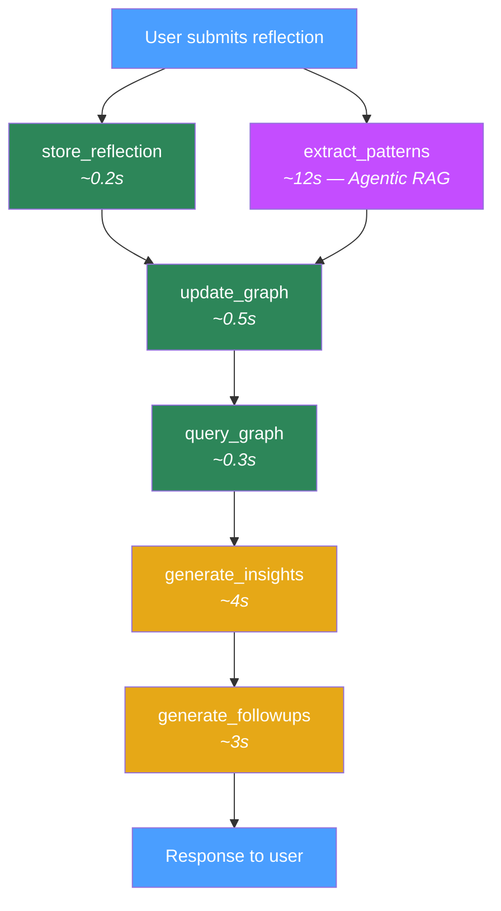
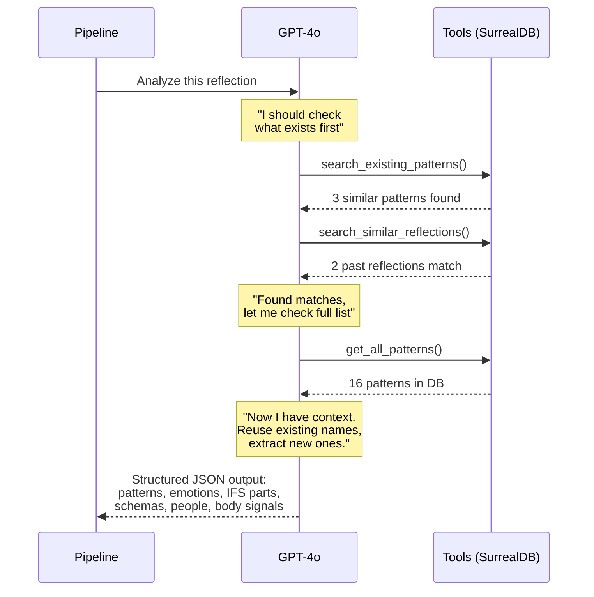
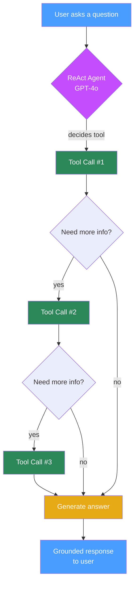
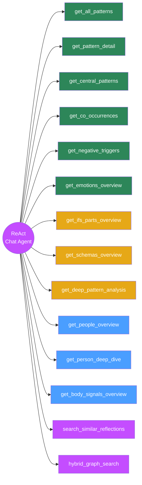
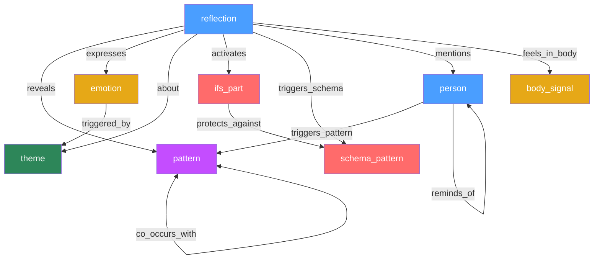
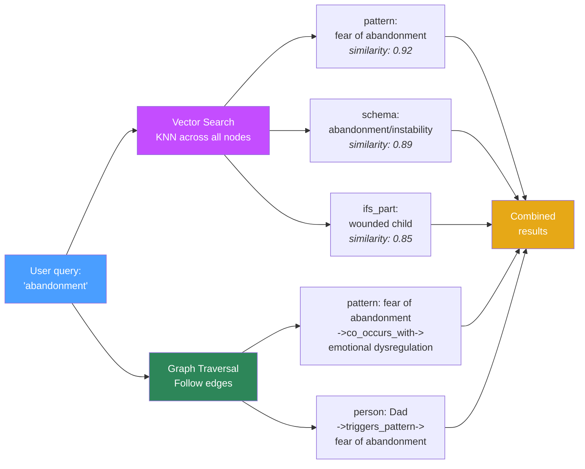

# Synapse — Mermaid Diagrams

## Scenario 1: Reflection Pipeline



## Extraction Agent — Agentic RAG Loop



## Scenario 2: Chat Agent — ReAct Loop



## Chat Agent — 14 Available Tools



## Knowledge Graph Schema



## Hybrid Search — Vector + Graph



## Full System Overview

```mermaid
graph TB
    subgraph User Interface
        UI[Streamlit / TypeScript App]
    end

    subgraph Reflection Pipeline
        RP[LangGraph StateGraph<br/>6 nodes, parallel entry]
    end

    subgraph Chat Agent
        CA[LangGraph ReAct Agent<br/>14 tools]
    end

    subgraph Extraction Agent
        EA[LangGraph ReAct Agent<br/>Agentic RAG]
    end

    subgraph SurrealDB v3 Cloud
        GDB[(Graph Database<br/>7 node types<br/>11 edge types)]
        VDB[(Vector Store<br/>HNSW indexes<br/>1536d embeddings)]
    end

    subgraph Observability
        LS[LangSmith<br/>Full trace on every node]
    end

    UI -->|submit reflection| RP
    UI -->|ask question| CA
    RP --> EA
    RP --> GDB
    RP --> VDB
    CA --> GDB
    CA --> VDB
    EA --> GDB
    EA --> VDB
    RP -.->|@traceable| LS
    CA -.->|@traceable| LS
    EA -.->|@traceable| LS

    style UI fill:#4a9eff,color:#fff
    style RP fill:#c44dff,color:#fff
    style CA fill:#c44dff,color:#fff
    style EA fill:#c44dff,color:#fff
    style GDB fill:#2d8659,color:#fff
    style VDB fill:#2d8659,color:#fff
    style LS fill:#e6a817,color:#fff
```
